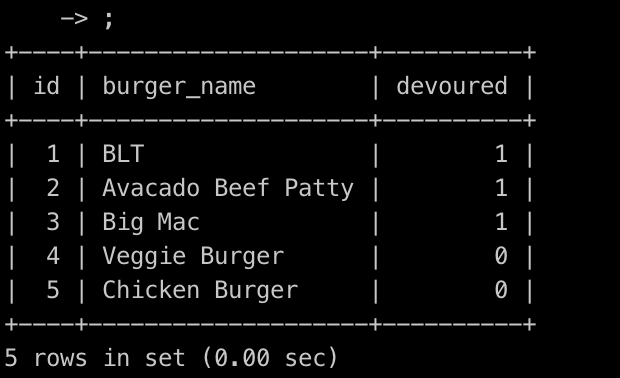

# burger
* * * A burger logger with MySQL, Node, Express, Handlebars and a homemade ORM.

* Burger is a restaurant app that lets users input the names of burgers they'd like to eat.

* Whenever a user submits a burger's name, app will display the burger on the left side of the page -- waiting to be devoured.

* Each burger in the waiting area also has a `Devour it!` button. When the user clicks it, the burger will move to the right side of the page.

* App will store every burger in a database, whether devoured or not.

* * * Use MySQL for Database.
* * * Use Express to handle routing. 

JavaScript, NodeJS, ORM
NPMs: Express, MySQL, Express-handlebars

**Install Express  *** npm install express
**Install MySQL  *** npm install mysql
**Install Handlebars  *** npm install express-handlebars

 
